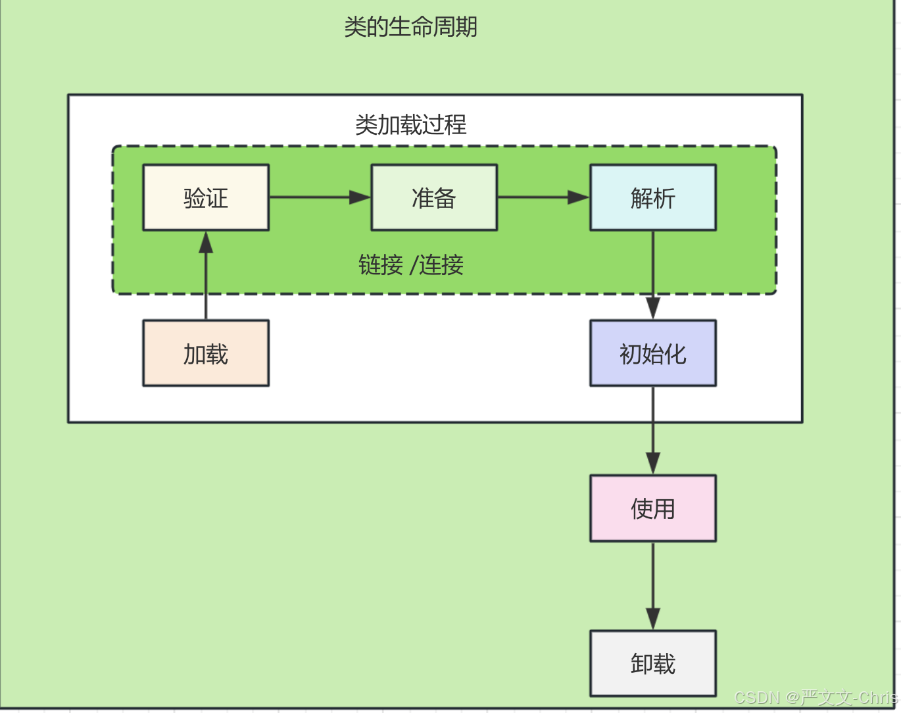

# java-classloader-study
通过图灵的程序员修改工资例子学习类加载器

# 1.类加载器机制
网上很多，不赘述，基本双亲委派机制
Bootstrap classloader -- JAVA_HOME/lib
Ext classloader -- jre/lib/ext
App classloader -- classpath路径下

类加载机制：
1.每个类加载器对他加载的类都一个缓存
2.向上委托查找，向下委托加载

# 2.类的加载过程：

步骤看图，这里想说的是类加载有个方法
classloader.loadClass(className, resolve)
resolve其实对应的就是上图绿色部份，值false代表不验证解析了，也就是有风险。

# 3.故事背景
有一oa系统，每个月都要定时计算程序元工资。
OaSystem 代表oa系统
SalaryCalc 代表工资计算系统

# 3.1 有一个程序员想要修改工资计算方法，偷偷加工资
他就想给工资加2成，直接在SalaryCalc上 salary*1.2
肯定会被发现，想个办法，抽出到一个jar包里，不再oa系统代码里

那怎么读取jar呢，肯定不能直接引入module了，不然还是能看到源代码，要单独引入jar，并读取jar内容
那就要采用类加载器加载jar包了

# 3.2 jar包可以反编译，需要加密
jar方式虽然隐蔽，但也是可以被反编译的，需要混淆一下
所以在生成salary jar的时候，需要对class文件做一下加密
比如可以修改文件后缀，添加混淆代码等
这里简单演示一下，请看class-encry模块，对生成的salary-system.jar执行ClassEntry方法进行加密，生成salary-system-encry-1.0.jar
PS:这里要先把oa-system模块中引入的salary-system模块移除！

# 3.3 开发自定义的类加载器，实现解密功能
其实就是实现SecurityClassLoader，继承SecureClassLoader，并实现loadClass重载方法
具体实现看代码
这样子，整套薪资的逻辑就被加密到jar包中，切不能反编译查看，还能正常解密加载，实现薪资计算功能。

# 3.4 要是公司突然要核算工资，必须要把代码改回去，怎么办？
需要准备另外一个jar : salary-system-encry-2.0.jar, 所有jar包如下：    
salary-system-encry-1.0.jar  -- 偷偷加工资  
salary-system-encry-2.0.jar  -- 正常发工资  
然后快速替换，怎么快速替换呢？   
使用文件变化监听，来根据配置选择哪个版本  
如果重启oa-system动作太大了，每次这么做很快就会被发现的，怎么办？需要热加载  
可是，又出现一个问题，类加载是有缓存的，如果一个类加载过了，就不会再加载了，怎么办？  
需要新建一个类加载器，重新加载
让我们来实现代码！

```aiignore
最终效果：
预发工资：2000.0,实际到手的工资：2400.0
预发工资：2000.0,实际到手的工资：2400.0
预发工资：2000.0,实际到手的工资：2400.0
预发工资：2000.0,实际到手的工资：2400.0
预发工资：2000.0,实际到手的工资：2400.0
预发工资：2000.0,实际到手的工资：2400.0
config.properties has changed. Reloading...
Configuration reloaded:
预发工资：2000.0,实际到手的工资：2000.0
预发工资：2000.0,实际到手的工资：2000.0
预发工资：2000.0,实际到手的工资：2000.0
预发工资：2000.0,实际到手的工资：2000.0

```
上述效果是实现了，可是这样一直new类加载器的方式，会导致出现大量的没用垃圾类，这也是热更新带来的问题。

在classLoader.loadClass中有个方法loadClass(className, resolve),其中resolve是用来干嘛的？
其实类加载过程可分为： 加载、连接、初始化，具体的过程作用，请自行查看资料，其中连接步骤是非常核心的步骤
主要用来验证类是否符合规范、准备变量和解析符号等逻辑，是防止黑客攻击的重要步骤，这个resolve=false时，就会
跳过该步骤，热加载一般都是没有该步骤的，因为默认值是false，这也意味着本来是在编译阶段的工作，被延迟到运行时，这就对整个程序运行的安全有很大威胁

# 3.5 有一天，某个人觉得调试很麻烦，就先在本地写了一个SalaryCalc类，忘记删除了，或者说引入了salary-system模块，忘记移除依赖了，怎么办？
将salary-system依赖引入oa—system
```xml
<project xmlns="http://maven.apache.org/POM/4.0.0" xmlns:xsi="http://www.w3.org/2001/XMLSchema-instance"
         xsi:schemaLocation="http://maven.apache.org/POM/4.0.0 http://maven.apache.org/xsd/maven-4.0.0.xsd">
    <modelVersion>4.0.0</modelVersion>
    <parent>
        <groupId>org.example</groupId>
        <artifactId>java-classloader-study</artifactId>
        <version>1.0-SNAPSHOT</version>
    </parent>

    <artifactId>oa-system</artifactId>
    <packaging>jar</packaging>

    <name>oa-system</name>
    <url>http://maven.apache.org</url>

    <properties>
        <project.build.sourceEncoding>UTF-8</project.build.sourceEncoding>
    </properties>

    <dependencies>
        <dependency>
            <groupId>org.example</groupId>
            <artifactId>salary-system</artifactId>
            <version>1.0-SNAPSHOT</version>
        </dependency>
        <dependency>
            <groupId>cn.hutool</groupId>
            <artifactId>hutool-crypto</artifactId>
            <version>5.8.29</version>
        </dependency>
        <dependency>
            <groupId>junit</groupId>
            <artifactId>junit</artifactId>
            <version>3.8.1</version>
            <scope>test</scope>
        </dependency>
    </dependencies>
</project>
```
结果，你会发现，无论你怎么修改参数，都不会再使用你写的jar包逻辑了
这是因为类加载的双亲委派机制导致的，打印一下SecurityClassLoader父类加载器
SecurityClassLoader的parent: securityClassLoader.getParent() = sun.misc.Launcher$AppClassLoader@18b4aac2
发现是AppClassLoader，
如果你引入了salary-system或者本地有个SalaryCalc类，根据双亲委派机制，
委托查找：securityClassLoader -> appClassLoader(not found) -> extClassLoader(not found) -> bootstrapClassLoader(not found)
发现都没找到，开始尝试加载：
bootstrapClassLoader(not found) -> extClassLoader(not found) -> appClassLoader(found) !!!
发现被appClassLoader加载到了，所以本地的securityClassLoader就不会再加载了，也就是都会共用appClassLoader加载的SalaryCalc了，完犊子
怎么办？
打破双亲委派机制，让securityClassLoader优先加载，当然了，这里要指定是哪些类优先本地加载，不然如果都从securityClassLoader优先加载，比如
Object类，那会出问题的！

# 3.6 能不能不要每次都新建一个类加载器，避免造成大量垃圾呢，即多版本共存
我们创建2个类加载器，分别将各自的类加载进来，并缓存起来存到Map里，具体逻辑看VersionSalaryCalc代码
这里要注意，不同类加载器加载进来的类，虽然包名、类名一样，但实际上是完全不同的两个类，
两个类比较：
[类加载器]org.example.SalaryCalc  前面的类加载器好像是一个隐藏的命名空间一样，类相等的前提，一定是同一个类加载器
所以，他们之间也是不能互相转换的，会出现以下把报错：
org.example.SalaryCalc cannot be cast to org.example.SalaryCalc

# 3.7 类加载器代码里加载的包名硬编码，这对系统扩展不友好，且使用的时候每次都要用反射，非常不友好
如果将jar看成不同的实现类，那我们只需要有一个通用的接口
第一步：抽出通用接口对象
```java
// 抽出通用的薪资计算接口
public interface SalaryCalcInterface {
    Double calc(Double salary);
}
```
第二步：让每个jar实现该接口
jar包里没有接口的话，只要复制一份相同的接口就行，具体就看代码

# 3.8 将接口抽到一个公用服务里，让实现交给具体的实现方--这就是java的SPI机制


